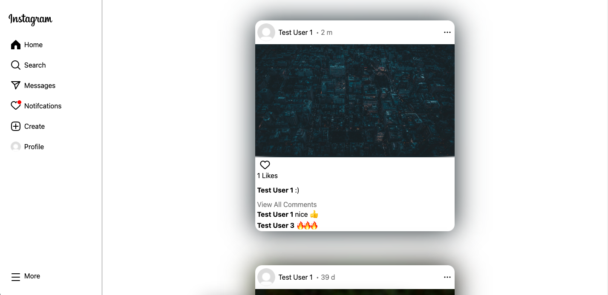

# Instagram Clone
This fullstack projects aims to recreate a fully functional version of Instagram with posting, commenting and messaging functionality with even more using React and Firebase for the backend. 

Live Demo: https://instagram-clone-57e2b.web.app

Note: Current hosting site may pop up with a security warning. It is safe to test the but don't use any actual passwords or sensitive information since proper security and encryption is not implemented.  

## Create Posts

## Post Page

## User Profiles

## Realtime Messaging

## Toggle Between Light and Dark Mode

## Features
### Profile
- Login and sign up with google or password.
- Follow and unfollow users. 

### Posts
- Create or delete posts with an image, text and a cropping.
- Like posts.
- Comment on posts.

### Messaging
- Realise messaging with other users.

### Notifications
- Get notifications if:
    - Post is liked or commented on.
    - User followed by another user. 

### Search
- Search for other users and update results realtime. 

### Settings
- Change username and profile.
- Change profile picture, bio and display name.

## Built With
- React
- Firebase